A Claude Code mod that picks the model for a session from its first prompt. [Laya](https://github.com/NandhaKishorM/laya) classifies the prompt on your own machine through `laya-serve`, so routing costs no tokens.

| Laya says the prompt is… | Model | Effort |
|---|---|---|
| a simple translation, lookup or rewrite | `claude-haiku-5-5` | low |
| writing a common query, script, email or summary | `claude-sonnet-5-5` | medium |
| finding and fixing a subtle bug or analysing a complex system | `claude-opus-5-5` | high |
| inventing new theories, hypotheses or proofs | `claude-fable-5-1` | xhigh |

## How it behaves

- **First prompt only.** Switching models mid-session drops the prompt cache, so the whole conversation is re-read at full price. The mod routes once and stays on that model.
- **Main thread only.** Subagents keep the model their definition names.
- **Falls back to `/model`.** When Laya's confidence is below 0.6, or `laya-serve` is unreachable, requests go out unchanged.
- **`/model` wins.** Change the model by hand after routing and the mod stops overriding for the rest of the session.
- **The status line shows what happened**: `laya → opus 0.87`, `laya: unsure (0.39), using /model`, `laya: offline, using /model`. `/model` keeps showing the session's own model, because a mod rewrites each request and can't set the session's model.

## Install

Start `laya-serve`, e.g. with this repo's `compose.yaml`:

```bash
docker compose up -d --wait   # http://localhost:8000
```

Then, in Claude Code:

```
/plugin install laya-router --marketplace marcreichel/laya-router
```

Install asks for `layaUrl` (default `http://localhost:8000`) and an optional `layaApiKey`, which is sent as a Bearer token.

## Develop

```bash
claude plugin validate .
claude plugin test .
claude --plugin-dir .
```
